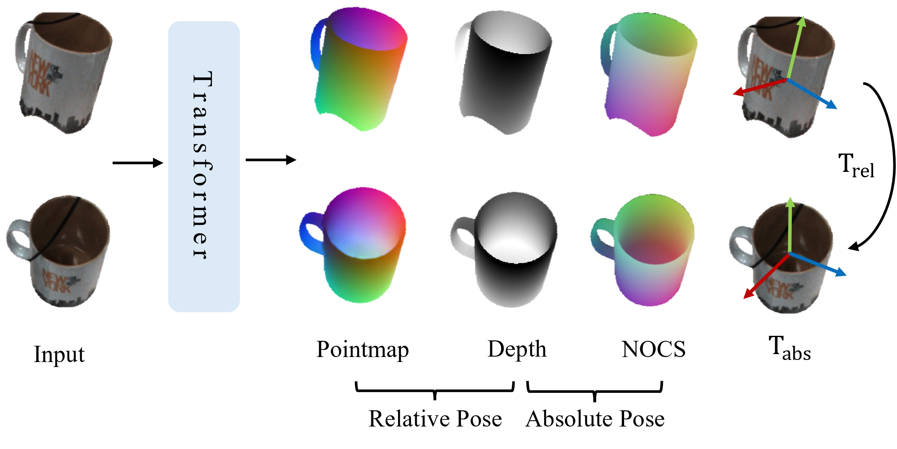
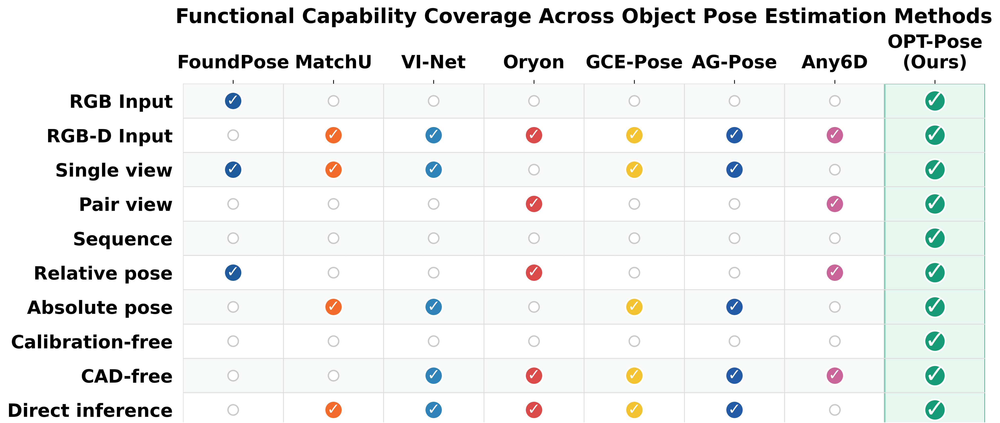
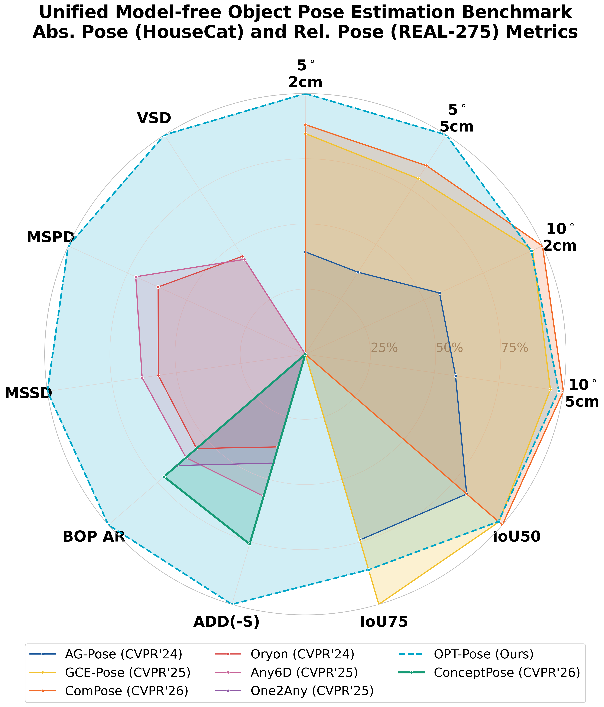

# Object Pose Transformer: Unifying Unseen Object Pose Estimation

<p align="center">
  <a href="https://colin-de.github.io/" target="_blank" rel="noopener noreferrer">Weihang Li</a><sup>1,2</sup>,
  Lorenzo Garattoni<sup>3</sup>,
  Fabien Despinoy<sup>3</sup>,
  Nassir Navab<sup>1,2</sup>,
  <a href="https://www.asg.ed.tum.de/pf/team/benjamin-busam/" target="_blank" rel="noopener noreferrer">Benjamin Busam</a><sup>1</sup>
</p>

<p align="center">
  <sup>1</sup>Technical University of Munich &nbsp;&nbsp;
  <sup>2</sup>Munich Center for Machine Learning &nbsp;&nbsp;
  <sup>3</sup>Toyota Motor Europe    &nbsp;&nbsp;
</p>

<p align="center">
  <a href="https://arxiv.org/abs/2603.23370">ArXiv</a> &nbsp;|&nbsp;
  <a href="https://colin-de.github.io/OPT-Pose/">Project Page</a> &nbsp;|&nbsp;
  <a href="https://github.com/colin-de/OPT-Pose">Code</a>
</p>

<p align="center">
  
</p>

OPT-Pose utilizes a feed-forward transformer to predict point map, depth, NOCS, and camera parameters. Existing category-level methods predict canonical absolute 9-DoF SA(3) poses (equivalent to Depth + NOCS), but require predefined category labels and calibrated cameras. Relative pose methods align unseen objects across views in 6-DoF SE(3) (equivalent to Pointmap + Depth), but do not support single-view absolute pose prediction. OPT-Pose enables the simultaneous recovery of both unseen-object relative and category-level absolute poses (right-most column) for flexible single or multi-view RGB or RGB-D input, without the need for CAD models or semantic labels.

## Overview

<p align="center">
  
</p>

<p align="center">
  
</p>

## Setup

The recommended setup is the conda environment because the code uses CUDA
extensions and GPU rendering dependencies:

```bash
conda env create -f environment.yml
conda activate opt-pose
pip install -e .
```

If you prefer an existing PyTorch environment, install the pip dependencies:

```bash
pip install -r requirements.txt
pip install -e .
```

Install PyTorch and CUDA-compatible dependencies according to your local GPU setup if the pinned conda packages in `environment.yml` do not match your system.

The SONATA components require `spconv` and `torch-scatter`; install versions compatible with your PyTorch/CUDA build.

Build the PointNet++ CUDA extension if your checkpoint uses the geometry encoder:

```bash
cd geo_models/pointnet2
python setup.py install
cd ../..
```

## Checkpoints

Weights are distributed outside git. Download the release checkpoints from the
[OPT-Pose Hugging Face repository](https://huggingface.co/colin1842/OPT-Pose):

```bash
mkdir -p pretrained
curl -L -o pretrained/abs_pose_housecat.pt \
  https://huggingface.co/colin1842/OPT-Pose/resolve/main/abs_pose_housecat.pt
curl -L -o pretrained/rel_pose.pt \
  https://huggingface.co/colin1842/OPT-Pose/resolve/main/rel_pose.pt
```

Then pass the downloaded checkpoint paths explicitly:

- [`abs_pose_housecat.pt`](https://huggingface.co/colin1842/OPT-Pose/blob/main/abs_pose_housecat.pt) for HouseCat6D absolute pose inference
- [`rel_pose.pt`](https://huggingface.co/colin1842/OPT-Pose/blob/main/rel_pose.pt) for NOCS and TOYL relative pose inference

## Datasets

Dataset roots are passed as command-line arguments and are not hard-coded. Expected inputs:

- `<HouseCat6D>`: HouseCat6D root with the official train/test folders and object model files.
- `<Oryon_NOCS>`: prepared NOCS relative-pose runtime root containing `camera.json`, `fixed_split/cross_scene_test/instance_list.txt`, object models, RGB/depth/mask data, and ground-truth pose files.
- `<Oryon_TOYL>`: prepared TOYL relative-pose runtime root containing `camera.json`, `fixed_split/cross_scene_test/instance_list.txt`, BOP models, RGB/depth/mask data, and scene metadata.

## Training

```bash
torchrun --nproc_per_node=<N> training/launch.py \
  --config housecat_default \
  data.train.dataset.dataset_configs.0.data_root=<HouseCat6D> \
  checkpoint.resume_checkpoint_path=<checkpoint>
```

## Inference

HouseCat6D absolute pose:

```bash
python test_abs_housecat6d.py \
  --data_root <HouseCat6D> \
  --checkpoint <housecat_ckpt> \
  --save_path <out_dir>
```

NOCS relative pose:

```bash
python test_rel_pose_nocs.py \
  --base_dir <Oryon_NOCS> \
  --checkpoint <rel_pose_ckpt> \
  --output <out_dir>
```

TOYL relative pose:

```bash
python test_rel_pose_toyl.py \
  --base_dir <Oryon_TOYL> \
  --checkpoint <rel_pose_ckpt> \
  --output <out_dir>
```

## Citation

If you find our work useful please cite:

```bibtex
@article{li2026object,
  title={Object Pose Transformer: Unifying Unseen Object Pose Estimation},
  author={Li, Weihang and Garattoni, Lorenzo and Despinoy, Fabien and Navab, Nassir and Busam, Benjamin},
  journal={arXiv preprint arXiv:2603.23370},
  year={2026}
}
```

## License

Project-owned code and documentation are released under the Creative Commons Attribution-NonCommercial-ShareAlike 4.0 International License. See `LICENSE`.

Some files contain upstream third-party notices. Those notices are preserved, and additional attribution is listed in `NOTICE`.
